<div align="center">


<a href="https://git.io/typing-svg">
  
</a>

</div>


## 🌌 About Me

<table>
<tr>
<td width="65%" valign="top">

```yaml
name: Muserah Saboor
role: AI/ML Engineer in training
education: "AI Undergraduate, University of Lahore (2030)"
location: "Lahore, Pakistan 🌙 | Open to Remote"
currently_exploring: [LLMs, Deep Learning, RAG Systems, Computer Vision]
languages: [English, Urdu]
goal: "Collaborate on impactful AI projects across the world "
```

</td>
<td width="35%" align="center">

</td>
</tr>
</table>


## 🛠️ Tech Arsenal

<div align="center">

#### 🐍 AI & Programming


#### 🌐 Tools & Development


</div>


## 📊 GitHub Analytics

<div align="center">


</div>


## 📜 Certifications & Achievements

<div align="center">

| 🏅 Certification | 🏛️ Issuing Organization | ✅ Status |
|:---|:---|:---:|
| **Certified in Artificial Intelligence** | Arfa Karim Technology Incubator (AKTI), Cohort C-15 | Completed |

</div>


## 🔭 Connect With Me

<table>
<tr>
<td width="35%" align="center">

</td>
<td width="65%" align="center">

[](https://www.linkedin.com/in/museerah-saboor-08a3a331a/)
[](https://github.com/muserah-hub)
 </a>
  <a href="mailto:saboormuserah@gmail.com" target="_blank">
    
  </a>

<br/>


</td>
</tr>
</table>


